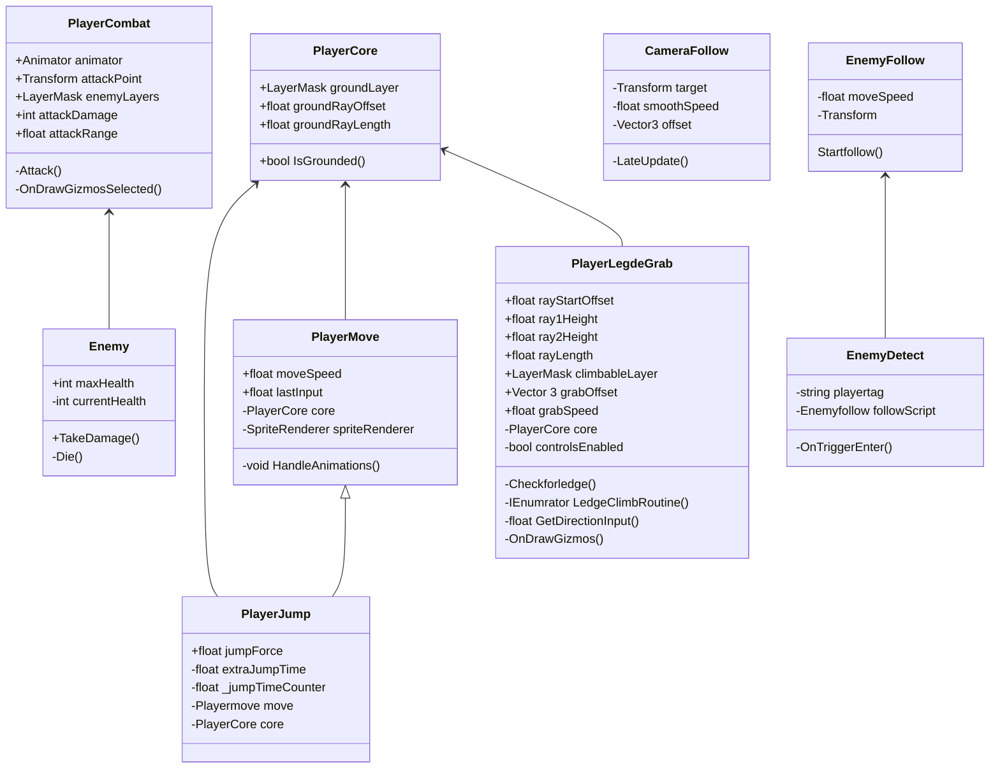

# M5

## les 1 opdracht 1


[](https://github.com/AT-STjemoeder/progJaar2/blob/main/Assets/scripts/M5/les%201/create%20ball.cs)

ik heb hier een random ballen spawner gemaakt met random kleuren en locatie en functions argument en return types geleerd
## les 1 opdracht 2


https://github.com/AT-STjemoeder/progJaar2/blob/main/Assets/scripts/les%201/tower.cs

ik heb geleerd hoe ik met randomizer met een m1 click een toren kan laten spawnen op een verschillende plek en verschillende grotes


## les 2


https://github.com/AT-STjemoeder/progJaar2/tree/main/Assets/scripts/M5/les%202

ik heb hier met action events een blokje gemaakt dat als het tegen een balletje aan gaat de score omhoog gaat

## les 3


hier maak ik gebruik van een breakpoint om te debuggen


## les 4


hier heb ik een bestaande "game" single response gemaakt en niet DRY
https://github.com/AT-STjemoeder/Space48

# M6

## les 2

hier heb ik mermaid leren te gebruiken zodat het makkelijker te begrijpen is voor de mensen die het niet hebben gecodeerd en het willen begrijpen.
## les 3


Hier hebben we geleerd om verschillende structs te gebruiken in unity zoals enums en scriptable objects en ook het verschil tussen een struct en een class.

## les 4


hier heb ik gebruik gemaakt van delegate's zodat ik de score kon aanpassen in realtime op het canvas.


## les 7
``` Csharp
public bool IsPlayerReadyToAttack(Player player)
{
 if (player == null) return false;
 if (!player.IsAlive) return false;
 if (player.AttackCooldown >0) return false;

 if (player.Target == null) return false;
 if (!player.Target.IsAlive) return false;

float distance = Vector3.Distance(player.transform.position, player.Target.transform.position)
if (distance >= 5f) return false;

if (player.IsStunned) return falsel
if (player.IsSlowed) return false;

bool hasManaAndWeapon
if (player.Mana >= 20 && player.WeaponEquipped)
        hasManaAndWeapon = true;

bool hasHealthAndBuff
if(player.Health > 30 && player.HasBuff("Strength"))
    hasHealthAndBuff = true;

if(!hasManaAndWeapon && !hasHealthAndBuff) return false;

    return True;
}
```

